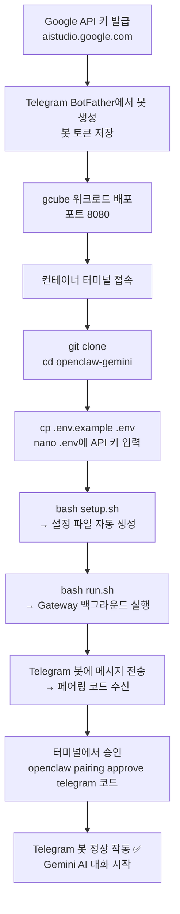

# OpenClaw Telegram AI Agent Gateway

Telegram 봇 `@openclaw_claude_da_bot`과 Google Gemini API를 연결하는 AI 에이전트 게이트웨이.
gcube 컨테이너 환경에서 `git clone → setup → run` 3단계로 배포 완료.

---

## 전체 흐름



---

## gcube 워크로드 설정

| 항목 | 값 |
|------|-----|
| 이미지 | `coollabsio/openclaw:latest` |
| 포트 | `8080` |
| 초기명령어 | `bash -c "apt-get update -qq && apt-get install -y nano vim && sleep infinity"` |

---

## 사전 준비

### 1. Google API 키 발급

- 발급: https://aistudio.google.com/
- 로그인 후 **Get API key** 메뉴에서 새 키 생성
- `AIza...` 형식의 키 복사

### 2. Telegram 봇 토큰 발급

- Telegram에서 `@BotFather` 검색 (파란 체크 확인)
- `/newbot` 입력 → 봇 이름, 유저네임 설정
- 발급된 토큰(`123456:ABC...` 형식) 저장

---

## 실행 방법

### 1. Clone

```bash
git clone https://github.com/chaeyoon-08/openclaw-gemini.git
cd openclaw-gemini
```

### 2. 환경변수 설정

```bash
cp .env.example .env
nano .env
```

`.env` 파일 내용:
```env
GOOGLE_API_KEY=여기에_API_키_입력
TELEGRAM_BOT_TOKEN=여기에_봇_토큰_입력
```

### 3. Setup (최초 1회)

```bash
bash setup.sh
```

다음 작업이 자동으로 실행됩니다:
- openclaw NPM 패키지 전역 설치
- `~/.openclaw/` 설정 파일 생성
- `~/.openclaw/workspace/` 생성 및 `identity/*.md` bootstrap 파일 복사 (AGENTS.md, IDENTITY.md)
- `docs/*.md` Knowledge Base 문서 복사

### 4. Gateway 실행

```bash
bash run.sh
```

출력 예시:
```
✅ Gateway 실행 중 (PID: 12345)

━━━━━━━━━━━━━━━━━━━━━━━━━━━━━━━━━━━━━━━━━━━━━━━━━━━━━
📱 Telegram 봇에 메시지를 보내면 페어링 코드가 발급됩니다.

  1. Telegram에서 @openclaw_claude_da_bot 에 메시지 전송
  2. 봇이 보내주는 페어링 코드 복사
  3. 아래 명령어로 승인:
     openclaw pairing approve telegram [코드]
━━━━━━━━━━━━━━━━━━━━━━━━━━━━━━━━━━━━━━━━━━━━━━━━━━━━━
```

### 5. Telegram 페어링

1. Telegram에서 생성한 봇(`@openclaw_claude_da_bot`)에 메시지 전송
2. 봇이 보내주는 페어링 코드 복사
3. 터미널에서 승인:

```bash
openclaw pairing approve telegram [코드]
```

승인 완료 후 봇과 대화 시작 가능.

---

## Knowledge Base 문서

`docs/` 폴더의 Markdown 파일과 `identity/` 폴더의 bootstrap 파일은 `setup.sh` 실행 시 자동으로 에이전트 workspace(`~/.openclaw/workspace/`)에 복사됩니다.

- `identity/AGENTS.md` → 에이전트 운영 지시사항 (한국어 응답 설정)
- `identity/IDENTITY.md` → 에이전트 정체성 (DA Assistant)
- `docs/*.md` → Knowledge Base 참조 문서

### 사용 방법

```bash
# 1. docs/ 폴더에 문서 추가
docs/
├── test_report.md
├── user_manual.md
└── faq.md

# 2. setup.sh 실행 (자동 복사)
bash setup.sh
# 출력: ✅ Knowledge Base 문서 복사 완료 (3개)

# 3. 복사 확인
ls ~/.openclaw/workspace/
# 출력: test_report.md  user_manual.md  faq.md
```

### 검증 예시

에이전트는 workspace의 문서를 참조하여 사용자 질문에 답변할 수 있습니다.

**질문**: "test report의 작성 날짜는?"
**기대 응답**: 문서 내용 기반 답변 (예: "2026년 3월 5일입니다")

---

## 테스트 성공 기준

| 항목 | 방법 | 성공 기준 |
|------|------|----------|
| 1. Gateway 실행 | `bash run.sh` 후 프로세스 확인 | PID 출력, 로그에 에러 없음 |
| 2. Telegram 연결 | 봇에 메시지 전송 | 페어링 코드 수신 |
| 3. 페어링 승인 | `openclaw pairing approve telegram [코드]` | 승인 완료 메시지 |
| 4. AI 응답 | 봇에 "안녕, 넌 뭘 할 수 있어?" 전송 | Gemini 기반 한국어 텍스트 응답 수신 |
| 5. 문서 기반 Q&A | 봇에 문서 관련 질문 전송 | workspace 문서 기반 정확한 답변 |

---

## 파일 구조

```
openclaw-gemini/
├── README.md              ← 실행 방법 (이 파일)
├── identity/              ← 에이전트 Bootstrap 파일
│   ├── AGENTS.md          ← 에이전트 지시사항 (한국어 답변)
│   └── IDENTITY.md        ← 에이전트 정체성 (DA Assistant)
├── docs/                  ← Knowledge Base 문서 저장소
│   └── test_report.md     ← 테스트 검증용 문서
├── spec/
│   ├── PRD.md             ← 제품 요구사항
│   └── SPEC.md            ← 기술 명세
├── setup.sh               ← 최초 1회: ~/.openclaw 설정 자동 생성
├── run.sh                 ← gateway 실행 + Telegram 페어링 안내
├── .env.example           ← API 키 형식 가이드 (git 추적됨)
├── .env                   ← 실제 API 키 (git 무시됨)
└── .gitignore
```

런타임 생성 디렉터리:
```
~/.openclaw/
├── openclaw.json          ← 게이트웨이 + 채널 설정
├── workspace/             ← 에이전트 작업 공간 (docs/*.md 복사됨)
├── agents/main/agent/
│   └── auth-profiles.json ← Google API 키
└── gateway.log            ← 게이트웨이 로그
```

---

## 문제 해결

### Gateway 실행 실패

로그 확인:
```bash
cat ~/.openclaw/gateway.log
```

### 프로세스 정리 및 재시작

```bash
pkill -9 -f "openclaw" 2>/dev/null || true
sleep 2
bash run.sh
```

### "gateway already running" 오류

```bash
rm -f /tmp/openclaw*.lock ~/.openclaw/*.lock
pkill -9 -f "openclaw" 2>/dev/null || true
sleep 2
bash run.sh
```

### Telegram 봇 미응답

페어링 상태 확인 및 재시도:
```bash
openclaw pairing list
openclaw pairing approve telegram [코드]
```

### 문서가 복사되지 않음

1. `docs/` 폴더 존재 확인: `ls docs/`
2. `.md` 파일 확인: `ls docs/*.md`
3. `setup.sh` 재실행: `bash setup.sh`
4. workspace 확인: `ls ~/.openclaw/workspace/`

---

## 주요 명령어

```bash
# 설정 초기화 (최초 1회 또는 설정 리셋)
bash setup.sh

# 게이트웨이 실행
bash run.sh

# 로그 확인
cat ~/.openclaw/gateway.log

# 페어링 목록 확인
openclaw pairing list

# 페어링 승인
openclaw pairing approve telegram [코드]

# 게이트웨이 프로세스 종료
pkill -9 -f "openclaw" 2>/dev/null || true

# 설정 파일 확인
cat ~/.openclaw/openclaw.json
```

---

## 기술 스택

| 레이어 | 기술 |
|--------|------|
| 런타임 | Node.js (openclaw NPM 패키지) |
| AI 모델 | Google Gemini 2.5 Flash (`google/gemini-2.5-flash`) |
| 채널 | Telegram Bot API (openclaw 내장 플러그인) |
| 인프라 | gcube 컨테이너 (`coollabsio/openclaw:latest`) |
| 설정 관리 | `~/.openclaw/openclaw.json`, `auth-profiles.json` |
| 스크립트 | Bash (`setup.sh`, `run.sh`) |

---

**프로젝트 명세**
- 제품 요구사항: [spec/PRD.md](spec/PRD.md)
- 기술 명세: [spec/SPEC.md](spec/SPEC.md)
