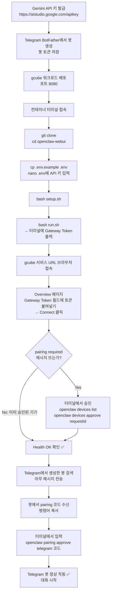

# 🦞 openclaw-webui

OpenClaw 인터페이스 테스트 — Web UI (브라우저) + Telegram 봇 연동

---

## 전체 흐름



---

## gcube 워크로드 설정

| 항목 | 값 |
|------|-----|
| 이미지 | `coollabsio/openclaw:latest` |
| 포트 | `8080` |
| 초기명령어 | `bash -c "apt-get update -qq && apt-get install -y nano vim locales locales-all && locale-gen ko_KR.UTF-8 && sleep infinity"` |

---

## 사전 준비

**Gemini API 키 발급** (무료, 신용카드 불필요)
- 발급: https://aistudio.google.com/apikey

**Telegram 봇 토큰 발급**
- Telegram에서 `@BotFather` 검색 (파란 체크 확인)
- `/newbot` 입력 → 봇 이름, 유저네임 설정
- 발급된 토큰 저장

---

## 실행 방법

**1. Clone**
```bash
git clone https://github.com/chaeyoon-08/openclaw-webui.git
cd openclaw-webui
```

**2. 환경변수 설정**
```bash
cp .env.example .env
nano .env
```
```
GEMINI_API_KEY=발급받은_Gemini_키
TELEGRAM_BOT_TOKEN=발급받은_Telegram_봇_토큰
```

**3. Setup (최초 1회)**
```bash
bash setup.sh
```

**4. 실행**
```bash
bash run.sh
```
- 터미널에 출력된 **Gateway Token** 복사

**5. Control UI 접속**
- gcube 서비스 URL로 브라우저 접속
- Overview 페이지 → **Gateway Token** 필드에 토큰 입력 → **Connect**

**6. Device Pairing 승인**
```bash
openclaw devices list
openclaw devices approve <requestId>
```

**7. Telegram 봇 연동**
- 봇에게 메시지 전송 → pairing 코드 수신
- 터미널에서 승인:
```bash
openclaw pairing approve telegram [코드]
```

---

## 테스트 성공 기준

| 레이어 | 방법 | 성공 기준 |
|--------|------|----------|
| 1. 접속 확인 | gcube URL 접속 | Health OK |
| 2. AI 응답 확인 | `안녕, 넌 뭘 할 수 있어?` 입력 | AI 텍스트 응답 |
| 3. Telegram 확인 | 봇에게 메시지 전송 | AI 답장 수신 |

---

## 파일 구조

```
openclaw-webui/
├── README.md        ← 실행 방법 (이 파일)
├── setup.sh         ← 최초 1회: ~/.openclaw 설정 자동 생성
├── run.sh           ← gateway 실행 + 접속 토큰 출력
├── .env.example     ← API 키 형식 가이드 (git 추적됨)
├── .env             ← 실제 API 키 (git 무시됨)
└── .gitignore
```

---

## 포트 변경

기본 포트: `8080`

| 파일 | 위치 |
|------|------|
| `run.sh` | `--port 8080` |
| `~/.openclaw/openclaw.json` | `gateway.port` 값 |

> ⚠️ gcube 워크로드 배포 시 설정한 포트와 반드시 일치

---

## 문제 해결

**gateway 실행 실패**
```bash
cat ~/.openclaw/gateway.log
```

**zombie 프로세스 쌓임**
- 컨테이너 재시작 필요 (init 시스템 없음)
```bash
pkill -9 -f "openclaw" 2>/dev/null || true
sleep 2
bash run.sh
```

**gateway already running 오류**
```bash
rm -f /tmp/openclaw*.lock ~/.openclaw/*.lock
pkill -9 -f "openclaw" 2>/dev/null || true
sleep 2
bash run.sh
```

**Telegram 봇 미응답**
```bash
openclaw pairing list
openclaw pairing approve telegram [코드]
```

**rate limit 에러**
- 1~2분 대기 후 재시도 (무료 플랜: 분당 10회 제한)
